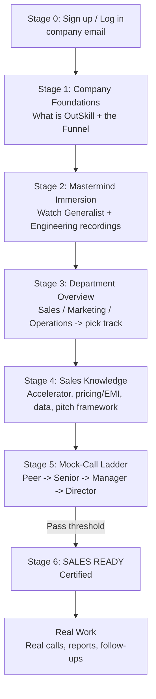

# OutSkill Training Platform — User Journey

**Product in one line:** an internal training bot/dashboard that takes a brand-new joiner from *Day 1* ("what is OutSkill?") all the way to *Sales Ready* (passed the mock-call ladder) and into real work — so seniors and managers stop re-running the same presentations and training calls.

The journey has **two layers**:

- **Layer A — Company Onboarding** (everyone, every department): understand OutSkill, the funnel, the masterminds, and what each department does.
- **Layer B — Department Track** (currently **Sales**): sales knowledge → mock-call ladder → certification → real work.

The platform is a **guided, gated path**: each stage unlocks the next, and a dashboard shows progress (locked / in-progress / done) so the joiner always knows the single next step.

---

## The journey at a glance

Maps onto today's code sections: `cover` → `dept` → `home` → `practice` → `salesuccess` → `realcall` / `reports` / `followups`. Stages 0–4 are the new front half; Stage 5 is your existing `practice` engine, formalised into levels; Stage 6 is `salesuccess` as a real gate.

---

## Stage 0 — Access & Identity  *(new)*

**Goal:** know who is using the platform and personalise their journey.

1. **Landing / Cover** (`cover`) — what this platform is, "Start your onboarding".
2. **Sign up / Log in** with **company email** (restrict to `@outskill.com` domain; reject personal emails).
3. First-time profile capture: **name, joining date, role** (New Joiner / Trainer-Senior / Manager / Admin), department (or "unassigned" until Stage 3).
4. Land on a **personalised Dashboard** = the journey map above, with everything locked except Stage 1.

**Roles matter here:**
- *New Joiner* — walks the journey.
- *Trainer / Senior / Manager / Director* — can act as the human customer in higher mock-call rounds and view a joiner's scorecards.
- *Admin* — manages content and thresholds.

**Unlock rule:** account created & verified → Stage 1 opens.

---

## Stage 1 — Company Foundations  *(Day 1, new)*

**Goal:** the "what is OutSkill" presentation seniors give on day one, self-served.

- **1.1 What is OutSkill** — an edtech company that sells AI courses.
- **1.2 The Products** — Bootcamp (low ticket), **Accelerator** (14-day, high ticket, *the main product*), Fellowship & Catalyst (6-month programs).
- **1.3 The Funnel:**
  - **TOFU** (Top) = Mastermind + Bootcamp
  - **MOFU** (Middle) = Accelerator (14-day)
  - **BOFU** (Deep) = Catalyst + Fellowship (6-month)
  - Audience flows: **Marketing campaigns → TOFU → Accelerator (MOFU) → BOFU**.
  - Rules: Catalyst can't be joined directly — learner must first do **Accelerator OR Fellowship**. Both Accelerator and Fellowship are attendable directly after a mastermind (sometimes Mastermind → Bootcamp → Accelerator).
- **1.4 The two mastermind tracks** — **Generalist** (Sat/Sun, non-technical) vs **Engineering** (Fri/Sat, technical / Python background). Free weekend workshops (~12–14 hrs) where we pitch Bootcamp + Accelerator.

**Gate:** a short **funnel knowledge check** (e.g. "Which programs are BOFU?", "Can a learner join Catalyst directly?") → unlocks Stage 2.

---

## Stage 2 — Mastermind Immersion  *(Days 2–5, new)*

**Goal:** learn *how we actually pitch* by watching the real thing.

- **2.1 Generalist Mastermind recording** — chunked into modules (the full 12–14 hrs split into watchable sections), each with key-takeaway notes and "what was pitched / how it was framed" annotations.
- **2.2 Engineering Mastermind recording** — same treatment.
- After each track: a quick check — *"How is the Accelerator pitched? What hooks land?"*

**Gate:** both tracks watched + checks passed → unlocks Stage 3.

---

## Stage 3 — Department Overview  *(new + existing `dept`)*

**Goal:** understand each department, then enter your track.

- **3.1 Department presentations** — short modules: what **Sales**, **Marketing**, **Operations** each do.
- **3.2 Department selection** (`dept` / `DeptSelect`, already built) — choose **Inside Sales** → Sales track. Marketing / Operations = "coming soon" for now.

**Gate:** department chosen → unlocks Stage 4 (Sales track).

---

## Stage 4 — Sales Knowledge  *(new, lives under `home` / `salesuccess`)*

**Goal:** everything a rep must *know* before they ever pitch.

- **4.1 The Sales role** — *who we call*: mastermind attendees who **did not pay** in the workshop. *The goal*: understand their intent for attending, the outcomes they wanted, **why they didn't pay** (money / time / doubt / no urgency), and re-pitch the Accelerator.
- **4.2 Accelerator deep dive** — 14-day live program, themes, the 48-hr buildathon, bonuses, mentors, outcomes (framed as ranges — **never promise jobs/salary**).
- **4.3 Pricing, Payment & EMI** — ties directly to the **payment-gateways sheet** we already built: India one-time (Razorpay), India EMI w/ credit card (Pine Labs, zero-cost), India debit-card EMI (Shopse, eligibility check), India NBFC route (Fibe / Propel via Google form), International (XP; +9% on installments).
- **4.4 How we get the data** — mastermind attendee data → CRM → assignment.
- **4.5 The Pitch Framework** — call structure: open & rapport → discover goals → diagnose the real blocker → handle objections (empathy + one fact, confirm it landed) → trial close → secure a concrete next step. Plus the **compliance hard-rules**.
- **4.6 Tools & assets** — the brochure, the onboarding-call flow, follow-up templates.

**Gate:** sales knowledge check → unlocks the Mock-Call Ladder.

---

## Stage 5 — Mock-Call Ladder  *(your existing `practice` engine, formalised)*

**Goal:** practice until ready — the unlimited mock calls, but structured and self-serve. Your engine (10 AI personas, the 0–100 scorecard across rapport / discovery / objection-handling / close / next-step, and the feedback card) is exactly this. We just turn it into **levels that unlock by score**, mirroring your real-world ladder:

| Level | Real-world round | AI customer difficulty | Example personas |
|------|------------------|------------------------|------------------|
| 1 | Peer practice | Warm / easy | Priya, Karthik |
| 2 | Senior round | Analytical / skeptical | Suresh, Meera |
| 3 | Utmost senior | Overconfident / noncommittal | Aditya, Rahul |
| 4 | Manager round | Hard, hidden blockers | Vikram, Arjun |
| 5 | Management round | Mixed, high pressure | custom + escalated |
| 6 | Director round | Hardest objections | custom + escalated |

- Each level requires **N calls at or above a minimum score** to unlock the next.
- A **human** (senior / manager / director, via their role login) can optionally join higher rounds in place of the AI.
- Every call ends with the **scorecard + specific feedback + best next action** (already built).

**Gate:** pass the Director round at threshold → **Sales Ready**.

---

## Stage 6 — Sales Ready → Real Work  *(existing `salesuccess` + `realcall` / `reports` / `followups`)*

**Goal:** certify, then hand over the real tools.

- **6.1 Certification** (`salesuccess`) — "Sales Ready" badge; logged for managers.
- **6.2 Real work unlocks:**
  - **Real Call** (`realcall`) — take live onboarding / pitch calls.
  - **Reports** (`reports`) — scores, call history, progress.
  - **Follow-ups** (`followups`) — manage prospects, share brochure, schedule next steps.
  - **Feedback Wall** (`feedbackwall`) — peer/senior feedback.

---

## Screen-by-screen summary

| # | Screen / Section | User does | Unlocks when |
|---|------------------|-----------|--------------|
| 0 | Cover → Auth (`cover`) | Sign up / log in w/ company email | Verified |
| 1 | Foundations | Learn OutSkill + funnel | Funnel quiz passed |
| 2 | Mastermind | Watch Generalist + Engineering recordings | Both + checks done |
| 3 | Departments (`dept`) | See depts, pick Inside Sales | Dept chosen |
| 4 | Sales Knowledge (`home`/`salesuccess`) | Accelerator, pricing/EMI, data, pitch framework | Knowledge check passed |
| 5 | Mock-Call Ladder (`practice`) | Climb Level 1→6, AI/human customers | Director round passed |
| 6 | Sales Ready (`salesuccess`) | Get certified | — |
| 6+ | Real Work (`realcall`/`reports`/`followups`) | Real calls, follow-ups, reporting | After certification |

---

## Gating / progress model

- Each stage = **locked / in-progress / complete**; the Dashboard always surfaces the **single next action**.
- Stages 0–4 are **linear** (must complete in order). Stage 5 is **level-gated by score**. Stage 6 is unlocked only by certification.
- Store per-user progress (stage, level, scores, certification) so a returning joiner resumes exactly where they left off.

---

## Suggested build order (what's already done vs. to add)

- ✅ **Already built:** `dept` → `home` → `practice` (personas + scorecard + feedback), `realcall`, `reports`, `followups`.
- 🔨 **Add next, in order:**
  1. **Auth + profile + Dashboard** (Stage 0) — the spine that tracks progress.
  2. **Progress/gating model** — locked/unlocked stages persisted per user.
  3. **Foundations + funnel quiz** (Stage 1).
  4. **Mastermind module player** (Stage 2).
  5. **Department presentations** (Stage 3).
  6. **Sales Knowledge modules** (Stage 4).
  7. **Level structure on the mock-call engine** (Stage 5) + **certification gate** (Stage 6).
